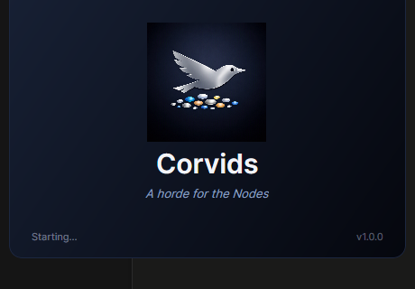
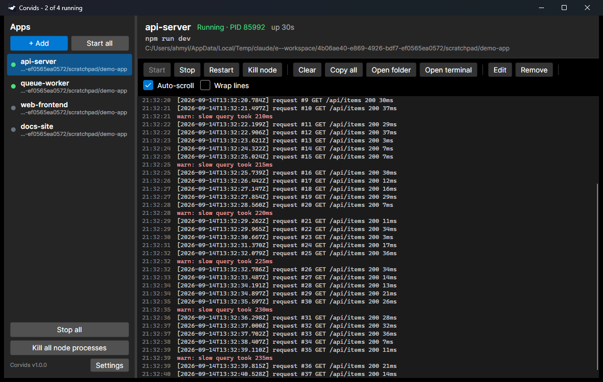

# Corvids



**One window for all the Node.js apps you keep running.**

*Corvids. A horde for the Nodes.*

Corvids is a small desktop app that replaces the pile of terminal tabs you keep open for your dev servers, bots and workers. Register each app once, and from then on you start, stop and restart them with a click, watch their console output live, and forget about which tab was which. Like pm2, but with a face, and without leaving orphaned node processes holding your ports.

Built with C# and [Avalonia](https://avaloniaui.net/), so the same code runs on Windows, macOS and Linux.



## Why

If your day looks like this:

- eight Git Bash tabs, each running `npm run dev` in a different folder
- "port 3000 is already in use" because something from yesterday is still alive
- pm2 for the daemons, terminals for the frontends, and no single place to see what is up

then Corvids is for you. Everything runs in one window, every app has its own log, and stopping an app
actually stops it.

## What it does

**Apps, not tabs**
- One entry per app: name, project folder, command (`npm run dev`, `pnpm start`, `node server.js`, anything)
- Add dialog reads `package.json` and suggests the scripts it finds (npm, pnpm, yarn, bun detected from the lockfile)
- Per-app environment variables, e.g. `NODE_ENV=production`
- Auto-start when Corvids opens, and pm2-style auto-restart on crash (5 s delay, gives up after 10 crashes in 10 minutes)

**Logs you can actually read**
- Live console per app with timestamps, stderr tinted, ANSI colour codes stripped, 5000-line buffer
- Auto-scroll that pauses when you scroll up and resumes at the bottom
- Wrap lines, Clear, Copy all, Ctrl+C copies selected lines

**Processes that really die**
- On Windows every app runs inside a Job Object, so Stop kills the whole tree, including grandchildren that
  Git Bash or npm detach from the shell. Restart waits for the app's port to be released first
- When the log shows `EADDRINUSE`, a banner offers "Kill it and restart" for whatever is holding the port
- "Kill node" per app finds stray node processes in that project folder or on its port and kills them
- "Kill all node processes" for when you just want a clean slate

**Runs the way you do**
- "Run with" picker per app: Windows: Git Bash (default when installed, so nvm in your `.bashrc` works),
  cmd.exe, PowerShell, WSL or a custom shell. macOS/Linux: your login shell, bash, zsh, pwsh or custom
- Close the window and choose: keep everything running in the system tray, or stop all and exit
- Settings: run at sign-in, start minimized to the tray, where the config file lives, a terminal command, and
  the log timestamp format (strftime-style tokens with a legend and live preview)
- A splash screen with the logo, motto and version on launch; Settings ▸ About reopens it (click to close)
- The config file is plain JSON and is watched: edit it in any editor and Corvids applies the change live

## Run from source

Requires the .NET 9 SDK.

```bash
git clone <this repo> E:\workspace\Corvids
cd E:\workspace\Corvids
dotnet run --project src/Corvids.csproj
```

## Build a release

Release builds are **self-contained**: the .NET runtime and Avalonia's native libraries are bundled, so the
target machine needs nothing installed. Pick the runtime identifier (`-r`) for the target and change the
output folder (`-o`) to match. The general command:

```bash
dotnet publish src/Corvids.csproj -c Release -r <RID> --self-contained true -p:PublishSingleFile=true -p:IncludeNativeLibrariesForSelfExtract=true -p:EnableCompressionInSingleFile=true -o dist/<folder>
```

| Target | RID | Command's `-r` and `-o` | Output |
| --- | --- | --- | --- |
| Windows x64 | `win-x64` | `-r win-x64 -o dist/release` | `dist/release/Corvids.exe` (~47 MB, single file) |
| Windows ARM64 | `win-arm64` | `-r win-arm64 -o dist/release-arm64` | `dist/release-arm64/Corvids.exe` (~46 MB, single file) |
| Linux x64 | `linux-x64` | `-r linux-x64 -o dist/release-linux-x64` | `dist/release-linux-x64/Corvids` (~47 MB, single file) |
| Linux ARM64 | `linux-arm64` | `-r linux-arm64 -o dist/release-linux-arm64` | `dist/release-linux-arm64/Corvids` (~45 MB, single file) |
| macOS Intel | `osx-x64` | `-r osx-x64 -o dist/release-osx-x64` | `dist/release-osx-x64/` (folder, ~62 MB) |
| macOS Apple Silicon | `osx-arm64` | `-r osx-arm64 -o dist/release-osx-arm64` | `dist/release-osx-arm64/` (folder, ~59 MB) |

After publishing, the `Corvids.pdb` (debug symbols) can be deleted; it is not needed to run.

### Requirements and caveats per platform

- **Windows (x64, ARM64).** Needs only 64-bit Windows 10 (1607+) or Windows 11. Copy the single
  `Corvids.exe` anywhere and double-click. First launch self-extracts the native libraries to a temp cache.
  The exe is unsigned, so SmartScreen may warn on first run: click **More info ▸ Run anyway**.
- **Linux (x64, ARM64).** A single file `Corvids`. Mark it executable first: `chmod +x Corvids`, then
  `./Corvids`. Self-contained bundles .NET but not base system libraries: a desktop distro normally has
  them, a minimal one may need `fontconfig` and `libicu` installed, plus a running display server
  (X11, or Wayland with XWayland).
- **macOS (Intel, Apple Silicon).** macOS does **not** fold the native libraries into the single file, so
  each build is a **folder** of the `Corvids` executable plus `libSkiaSharp.dylib`, `libHarfBuzzSharp.dylib`
  and `libAvaloniaNative.dylib`. Ship the whole folder, keep the files together. Mark it executable
  (`chmod +x Corvids`). It is unsigned and unnotarized, so Gatekeeper blocks it: clear the quarantine flag
  with `xattr -cr Corvids`, or right-click in Finder and choose **Open**. It runs as a bare executable, not
  a double-clickable `.app` bundle.

### Framework-dependent build (smaller, Windows)

About 26 MB instead of ~47 MB, but the target must have the
[.NET 9 Desktop Runtime](https://dotnet.microsoft.com/download/dotnet/9.0) installed; it will not run on a
fresh Windows without it.

```bash
dotnet publish src/Corvids.csproj -c Release -r win-x64 --self-contained false -p:PublishSingleFile=true -o dist/win
```

Trimmed builds (`-p:PublishTrimmed=true`) compile but are untested because the XAML uses reflection bindings.

## Quick start

1. Click **+ Add**, pick the project folder. Corvids reads `package.json` and lists the scripts.
2. Click the script you want (or type any command), tick **Start automatically** if it should come up
   with Corvids, tick **Restart automatically** if it is a daemon, and save.
3. Press **Start**. The log fills in. Repeat for every app you used to keep a tab for.
4. Close the window when you're done and pick **Keep running in tray**.

## Testing

Run the whole suite before pushing:

```bash
dotnet test
```

Or use the helper scripts: `test.cmd` on Windows, `./run-tests.sh` on macOS/Linux. Tests use xUnit and live
in `tests/Corvids.Tests`. They cover the deterministic logic (environment parsing, config and settings
round-trips, shell command building, package.json script detection across npm/pnpm/yarn/bun, and the
port and node-process helpers) and never touch your real config: a throwaway temp folder is used via
`CORVIDS_CONFIG_DIR`.

## Configuration

Entries live in `apps.json`, settings in `settings.json`:

- Windows: `%APPDATA%\Corvids\`
- macOS / Linux: `~/.config/Corvids/`
- Override the folder with the `CORVIDS_CONFIG_DIR` environment variable, or point `apps.json` anywhere from Settings

An entry looks like this:

```json
{
  "Name": "api",
  "WorkingDirectory": "E:\\workspace\\api",
  "Command": "npm run dev",
  "AutoStart": true,
  "AutoRestart": true,
  "Environment": "NODE_ENV=development\nPORT=3000",
  "Shell": "Auto"
}
```

`Shell` is one of `Auto`, `GitBash`, `Cmd`, `PowerShell`, `Wsl`, `Bash`, `Zsh`, `Custom`. With `Custom`,
`CustomShell` holds the full command line and `{cmd}` stands for the app command, e.g.
`C:\msys64\usr\bin\bash.exe -lc "{cmd}"`. Set `CORVIDS_BASH` to point at a bash.exe in a non-standard place.

## Notes

- Git Bash, bash and zsh are started as login shells (`-lc`) so PATH additions from nvm, volta or
  homebrew in your profile apply. zsh does not read `.zshrc` non-interactively; use Custom with
  `zsh -ic "{cmd}"` if nvm lives there.
- `FORCE_COLOR=0` and `NO_COLOR=1` are set for child processes so most tools skip colour output.
- Stop is a hard kill. Dev servers handle that fine; anything that needs a graceful shutdown should be
  stopped from its own UI first.

## License

Corvids is free software, licensed under the **GNU General Public License v3.0 or later**. You may use,
study, share and modify it; if you distribute a modified version, it must also be licensed under the GPL.
See [LICENSE](LICENSE) for the full text.

```
Copyright (C) 2026 ahmyi

This program is free software: you can redistribute it and/or modify it under the terms of the GNU
General Public License as published by the Free Software Foundation, either version 3 of the License, or
(at your option) any later version.

This program is distributed in the hope that it will be useful, but WITHOUT ANY WARRANTY; without even the
implied warranty of MERCHANTABILITY or FITNESS FOR A PARTICULAR PURPOSE. See the GNU General Public
License for more details.
```

